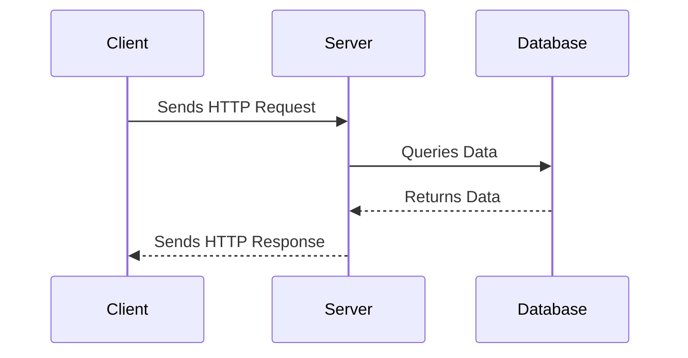

# Sample Node.js Application

This document provides an overview of a sample Node.js application, including its architecture and workflow.

## Application Architecture

The application follows a typical MVC (Model-View-Controller) architecture. Below is a diagram representing the structure:

```mermaid
graph TD
    A[Client] -->|HTTP Request| B[Controller]c
    B -->|Processes Request| C[Model]
    C -->|Fetches Data| D[Database]
    C -->|Returns Data| B
    B -->|Sends Response| A
```

## Workflow.

The workflow of the application is illustrated below:



## Features

- **Routing**: Handles HTTP requests and directs them to the appropriate controller.
- **Database Integration**: Connects to a database to fetch and store data.
- **Error Handling**: Provides robust error handling for various scenarios.

## Getting Started

1. Clone the repository:
   ```bash
   git clone https://github.com/your-repo/sample-node-app.git
   ```
2. Install dependencies:
   ```bash
   npm install
   ```
3. Start the application:
   ```bash
   npm start
   ```

## Reference Links

- [Node.js Documentation](https://nodejs.org/en/docs/)
- [Express.js Guide](https://expressjs.com/)
- [Mermaid.js Documentation](https://mermaid-js.github.io/mermaid/)
